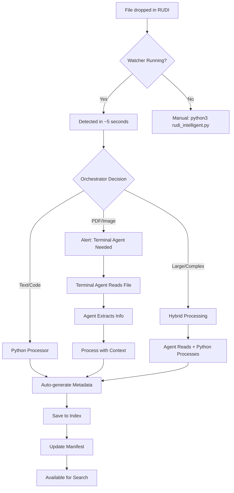

# RUDI Complete System Documentation
## Responsible Use of Digital Intelligence - File Processing Pipeline

---

## 🏗️ System Architecture

```
┌─────────────────────────────────────────────────────────────┐
│                         RUDI SYSTEM                          │
├───────────────┬────────────────┬──────────────┬─────────────┤
│   DROPZONE    │     WATCHER    │  ORCHESTRATOR│  PROCESSOR  │
│   /RUDI/      │  rudi_watcher  │rudi_orchestr.│ intelligent │
│               │   (monitors)   │  (decides)   │ (processes) │
└───────────────┴────────────────┴──────────────┴─────────────┘
                           ↓
┌─────────────────────────────────────────────────────────────┐
│                         INDEX                                │
│  /Index/metadata/  →  Metadata JSON files                   │
│  /Index/manifest.jsonl  →  Processing log                   │
│  /Index/logs/  →  System logs                              │
└─────────────────────────────────────────────────────────────┘
```

---

## 📁 Directory Structure

```
~/.rudi/workspaces/rudi-processor/
├── RUDI/                         # Dropzone - place files here
│   ├── *.pdf, *.txt, *.md      # Any files to process
│   ├── README.md                # Dropzone instructions
│   ├── AGENT_INSTRUCTIONS.md    # Terminal agent guide
│   └── TERMINAL_AGENT_INSTRUCTIONS.md
│
├── Index/                        # Metadata storage
│   ├── metadata/                # JSON metadata files
│   │   └── YYYY-MM/            # Organized by month
│   │       └── *.meta.json     # Individual metadata
│   ├── manifest.jsonl           # Master processing log
│   ├── logs/                    # System logs
│   │   ├── processor_*.log
│   │   ├── watcher_*.log
│   │   └── orchestrator_*.log
│   └── .watcher_state.json      # Watcher state tracking
│
└── tools/rudi-processor/         # Processing tools
    ├── Core Scripts
    │   ├── process_rudi.py      # Basic processor
    │   ├── rudi_intelligent.py  # Smart processor
    │   ├── rudi_orchestrator.py # Decision engine
    │   ├── rudi_watcher.py      # File monitor
    │   ├── rudi_audit.py        # Status checker
    │   └── terminal_agent_processor.py # For agent use
    │
    ├── Shell Scripts
    │   ├── start_watcher.sh     # Start monitoring
    │   ├── stop_watcher.sh      # Stop monitoring
    │   ├── watcher_status.sh    # Check status
    │   └── rudi_status.sh       # Quick stats
    │
    ├── Library
    │   └── lib/processors/
    │       ├── file_processor.py
    │       ├── intelligent_processor.py
    │       └── pdf_extractor.py
    │
    └── Configuration
        └── config/
            └── rudi-config.json  # System config

```

---

## 🔄 Processing Workflows

### Workflow 1: Fully Manual
```
User drops file → User runs processor → Metadata created
```

**Commands:**
```bash
cd /path/to/rudi-processor

# Process everything
python3 rudi_intelligent.py

# Process specific file
python3 rudi_intelligent.py /path/to/file.pdf
```

### Workflow 2: Semi-Automated (Watcher + Manual Terminal Agent)
```
User drops file → Watcher detects → Decides strategy:
  → If text/code: Auto-processes with Python
  → If PDF/image: Alerts "Terminal Agent needed!"
     → User (terminal agent) reads file
     → User runs terminal_agent_processor.py
```

**Start watcher:**
```bash
./start_watcher.sh  # Runs in background
```

**When alert appears:**
```bash
# Terminal agent reads the file
Read ~/.rudi/workspaces/rudi-processor/inbox/document.pdf

# Terminal agent processes with extracted info
python3 terminal_agent_processor.py --file-info '{
  "path": "/path/to/file",
  "author": "extracted_author",
  "document_type": "contract",
  "suggested_category": "Professional/Legal",
  ...
}'
```

### Workflow 3: Fully Automated (Limited)
```
User drops file → Watcher detects → Auto-processes
(Only works for text/code files, not PDFs/images)
```

---

## 🤖 Terminal Agent Integration

### When Terminal Agent is Needed

The system needs a terminal agent when:
- **PDFs** - Agent can read content directly
- **Images** - Agent can analyze visually
- **Audio/Video** - Agent can understand media
- **Low confidence** - Agent can make better decisions

### Terminal Agent Activation Process

1. **Watcher detects file needing agent:**
```
🔔 New file detected: contract.pdf
⚡ ACTION REQUIRED: Terminal Agent needed for contract.pdf
```

2. **Terminal agent reads the file:**
```bash
# Use Read tool to examine content
Read ~/.rudi/workspaces/rudi-processor/inbox/contract.pdf
```

3. **Terminal agent extracts information:**
- Document type (contract, resume, report, etc.)
- Key parties/entities
- Main topics
- Appropriate category

4. **Terminal agent processes with context:**
```bash
python3 terminal_agent_processor.py --file-info '{
  "path": "~/.rudi/workspaces/rudi-processor/inbox/contract.pdf",
  "original_name": "contract.pdf",
  "document_type": "service-agreement",
  "parties": ["Company A", "Company B"],
  "suggested_category": "Professional/Legal",
  "topics": ["services", "payment", "terms"],
  "confidence_reason": "Read the PDF - this is a service agreement",
  "summary": "Service agreement between Company A and B for consulting"
}'
```

---

## 🎯 Decision Logic

The orchestrator decides processing strategy based on:

| File Type | Size | Strategy | Reasoning |
|-----------|------|----------|-----------|
| .txt, .md | <1MB | Python | Fast, simple extraction |
| .pdf | Any | Terminal Agent | Needs content reading |
| .jpg, .png | Any | Terminal Agent | Needs visual analysis |
| .csv, .json | <5MB | Python | Structured, parseable |
| .mp3, .mp4 | Any | Terminal Agent | Needs media understanding |

---

## 🛠️ Commands Reference

### Processing Commands
```bash
# Basic processing
python3 process_rudi.py

# Intelligent processing
python3 rudi_intelligent.py

# With orchestration
python3 rudi_orchestrator.py

# Terminal agent processing
python3 terminal_agent_processor.py --file-info '{...}'

# Dry run (preview without processing)
python3 rudi_intelligent.py --dry-run
```

### Watcher Commands
```bash
# Start background monitoring
./start_watcher.sh

# Stop monitoring
./stop_watcher.sh

# Check status
./watcher_status.sh

# One-time check
python3 rudi_watcher.py --once

# Custom interval (10 seconds)
python3 rudi_watcher.py --interval 10
```

### Audit Commands
```bash
# Full audit
python3 rudi_audit.py

# Detailed view
python3 rudi_audit.py --detailed

# Export to JSON
python3 rudi_audit.py --export

# Quick stats
python3 rudi_audit.py --stats-only

# Show only unprocessed
python3 rudi_audit.py --unprocessed-only
```

### Search Commands
```bash
# Search indexed files
python3 search_rudi.py "search term"

# List all files
python3 search_rudi.py --list

# Show statistics
python3 search_rudi.py --stats
```

---

## 🔧 Configuration

### Main Config: `/config/rudi-config.json`
```json
{
  "dropzone_path": "~/.rudi/workspaces/rudi-processor/inbox",
  "index_path": "~/.rudi/workspaces/rudi-processor/index",
  "supported_extensions": {...},
  "classification_categories": [...],
  "embedding_config": {...}
}
```

### Categories
- Education/AI-Literacy
- Professional/Legal
- Professional/Resume
- Technical/Documentation
- Personal/Notes
- Creative/Media
- Resources/References

---

## 📊 Metadata Schema

Each processed file generates:
```json
{
  "original_name": "document.pdf",
  "new_name": "2025-08-07-professional-legal-contract.pdf",
  "category": "Professional/Legal",
  "subcategory": "Contracts",
  "confidence": 0.95,
  "hash": "sha256_hash",
  "processed_at": "2025-08-07T12:00:00",
  "processed_by": "terminal-agent-enhanced",
  "topics": ["contract", "services", "agreement"],
  "entities": ["Company A", "Company B"],
  "summary": "Service agreement between...",
  "needs_review": false
}
```

---

## 🚨 Current Issues & Solutions

### Issue: Module Import Error
```
ModuleNotFoundError: No module named 'processors'
```

**Cause:** Python scripts called from different directories can't find the lib modules.

**Solution:** Need to fix the Python path in scripts.

### Issue: PDFs Can't Be Auto-Processed
**Cause:** Python processor can't read PDF content without libraries.

**Solution:** Terminal agents must handle PDFs using Read tool.

---

## 🎭 Processing Modes

### 1. Development Mode (Current)
- Manual processing
- Testing and refinement
- Terminal agent handles complex files

### 2. Production Mode (Future)
- Automated watcher running 24/7
- Terminal agent alerts for complex files
- Auto-organization into Library folders

### 3. Hybrid Mode (Recommended)
- Watcher for detection
- Auto-process simple files
- Terminal agent for complex files
- Human review for low confidence

---

## 📈 System Flow Diagram



---

## 🔮 Future Enhancements

1. **Auto-PDF Processing**
   - Add PyPDF2 for text extraction
   - OCR for scanned documents

2. **Embeddings & Vector Search**
   - Generate semantic embeddings
   - Enable similarity search

3. **AI Classification**
   - Use OpenAI/Claude for categorization
   - Improve confidence scores

4. **File Organization**
   - Auto-move to Library folders
   - Maintain source references

5. **Web Interface**
   - Dashboard for monitoring
   - Search interface
   - Processing queue

---

## 📝 Quick Start Guide

### First Time Setup
```bash
# 1. Navigate to processor
cd /path/to/rudi-processor

# 2. Check current status
python3 rudi_audit.py

# 3. Process any unprocessed files
python3 rudi_intelligent.py

# 4. Start the watcher (optional)
./start_watcher.sh
```

### Daily Usage
```bash
# Drop files in RUDI folder
# If watcher running: auto-processes or alerts
# If not: run python3 rudi_intelligent.py
```

### Terminal Agent Usage
```bash
# When alerted about PDF/image:
1. Read the file using Read tool
2. Extract key information
3. Run terminal_agent_processor.py with extracted info
```

---

## 🆘 Troubleshooting

| Problem | Solution |
|---------|----------|
| Module not found | Run from rudi-processor directory |
| Watcher not detecting | Check with `./watcher_status.sh` |
| Duplicate processing | Check manifest, use audit tool |
| Low confidence | Use terminal agent for better results |
| Can't read PDF | Terminal agent must use Read tool |

---

*Last Updated: August 7, 2025*
*System Version: 1.0*
*Created by: RUDI Development Team*
