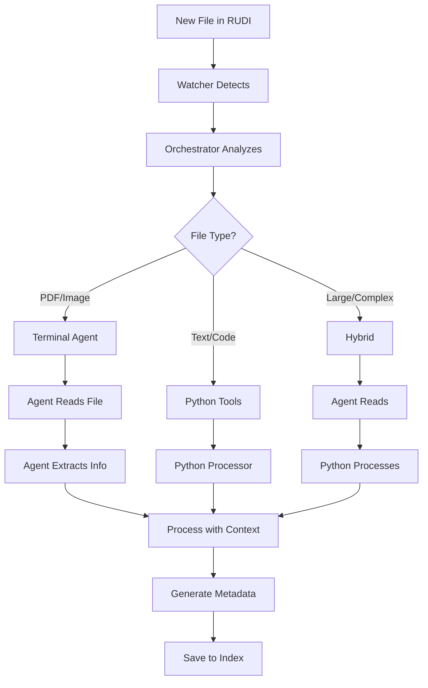

# RUDI Intelligent Processing Workflow

## 🎯 Complete Processing Pipeline

```
File Drop → Watcher → Orchestrator → Strategy Decision → Processing → Metadata
```

## 📊 Decision Flow



## 🚀 Starting the System

### 1. Manual Processing (Current)
```bash
# Process specific file
python3 rudi_intelligent.py /path/to/file

# Process all RUDI files
python3 rudi_intelligent.py

# Check what needs Terminal Agent
python3 rudi_orchestrator.py --terminal-agent
```

### 2. Automated Watching
```bash
# Start the watcher (checks every 5 seconds)
python3 rudi_watcher.py

# Custom interval (check every 10 seconds)
python3 rudi_watcher.py --interval 10

# One-time check
python3 rudi_watcher.py --once
```

### 3. Terminal Agent Processing
When the system detects a file needs Terminal Agent processing:

```bash
# Step 1: Terminal Agent reads the file
Read ~/.rudi/workspaces/rudi-processor/inbox/document.pdf

# Step 2: Terminal Agent extracts information
# (You analyze the content and extract key data)

# Step 3: Process with the extracted information
python3 terminal_agent_processor.py --file-info '{
  "path": "/path/to/file",
  "author": "extracted_author",
  "title": "extracted_title",
  "document_type": "resume|report|etc",
  "suggested_category": "Professional/Resume",
  "topics": ["topic1", "topic2"],
  "summary": "Brief summary from actual content"
}'
```

## 🎼 Orchestration Strategy

The orchestrator (`rudi_orchestrator.py`) makes intelligent decisions:

### File Size & Type Matrix

| File Type | Small (<1MB) | Medium (1-10MB) | Large (>10MB) |
|-----------|-------------|-----------------|---------------|
| **PDF**   | Terminal Agent | Terminal Agent | Hybrid |
| **Images** | Terminal Agent | Terminal Agent | Terminal Agent |
| **Text/MD** | Python Tool | Python Tool | Terminal Agent |
| **Code** | Python Tool | Python Tool | Python Tool |
| **CSV** | Python Tool | Python Tool | Terminal Agent |
| **Audio/Video** | Terminal Agent | Terminal Agent | Terminal Agent |

### Processing Strategies

#### 🤖 Terminal Agent Strategy
Best for:
- PDFs (can read directly)
- Images (can analyze visually)
- Audio/Video (can understand content)
- Files needing semantic understanding

Process:
1. Agent reads file with Read tool
2. Extracts meaningful information
3. Generates high-confidence metadata
4. Passes to processor

#### 🐍 Python Tool Strategy
Best for:
- Text files (fast processing)
- Code files (syntax understanding)
- Structured data (JSON, CSV)
- Small files with clear patterns

Process:
1. Python reads file directly
2. Pattern matching for classification
3. Generates metadata
4. Saves to Index

#### 🔄 Hybrid Strategy
Best for:
- Large complex documents
- Files needing both reading and processing
- Multi-format content
- When confidence is low

Process:
1. Terminal Agent reads and understands
2. Passes insights to Python tools
3. Python processes with context
4. Combined metadata generation

## 📝 Example Workflow

### Scenario: New PDF dropped in RUDI

1. **File Dropped**
   ```
   User drops: "contract-2025.pdf" into RUDI
   ```

2. **Watcher Detects** (if running)
   ```
   🔔 New file detected: contract-2025.pdf
   ```

3. **Orchestrator Decides**
   ```
   📊 Strategy: terminal_agent (PDF, 2.3MB)
   ```

4. **Terminal Agent Instructions Generated**
   ```json
   {
     "file_path": "~/.rudi/workspaces/rudi-processor/inbox/contract-2025.pdf",
     "task": "read_and_analyze",
     "requirements": [
       "Read the PDF content",
       "Extract: title, parties, date, type",
       "Determine if it's a contract, agreement, invoice",
       "Identify key entities",
       "Generate meaningful filename"
     ]
   }
   ```

5. **Terminal Agent Processes**
   ```bash
   # Agent reads PDF
   Read ~/.rudi/workspaces/rudi-processor/inbox/contract-2025.pdf

   # Agent sees it's a service agreement
   # Extracts: parties, dates, terms

   # Agent calls processor
   python3 terminal_agent_processor.py --file-info '{
     "path": "...",
     "document_type": "service-agreement",
     "parties": ["Acme Corp", "Consulting LLC"],
     "suggested_category": "Professional/Legal",
     ...
   }'
   ```

6. **Metadata Generated**
   ```
   ✨ New name: 2025-08-07-professional-legal-acme-service-agreement.pdf
   📂 Category: Professional/Legal
   📊 Confidence: 95%
   ```

## 🔧 Configuration

### Adjusting Processing Rules

Edit `rudi_orchestrator.py` to modify:
- File size thresholds
- Strategy assignments
- Confidence requirements

### Adding New File Types

1. Add to orchestrator strategy map
2. Create extraction method
3. Update terminal agent instructions

## 🎭 Mixed Mode Operation

The system can run in different modes:

### Fully Automated
```bash
# Start watcher - processes everything automatically
python3 rudi_watcher.py
```

### Semi-Automated
```bash
# Watcher alerts when Terminal Agent needed
python3 rudi_watcher.py
# Terminal Agent manually processes flagged files
```

### Manual Control
```bash
# Process files on demand
python3 rudi_orchestrator.py /path/to/file
```

## 📈 Intelligence Levels

1. **Level 0**: Basic filename processing
2. **Level 1**: Pattern matching (Python only)
3. **Level 2**: Content extraction (Python with libraries)
4. **Level 3**: Semantic understanding (Terminal Agent)
5. **Level 4**: Hybrid intelligence (Agent + Tools)

## 🎯 Goal

The goal is **Responsible Use of Digital Intelligence**:
- Use Terminal Agent capabilities when they add value
- Use Python tools for efficient batch processing
- Combine both for optimal results
- Always make intelligent choices based on context

---

*The system gets smarter over time as it learns your filing patterns and preferences.*
